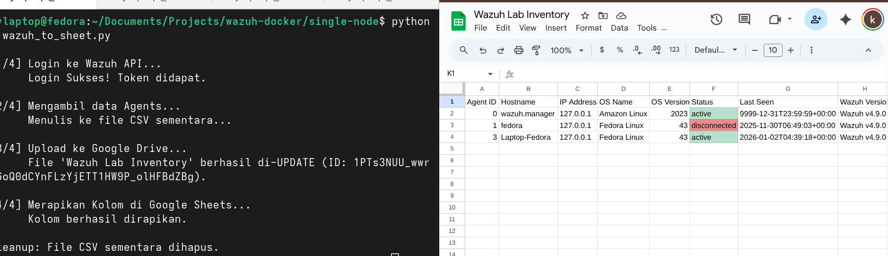
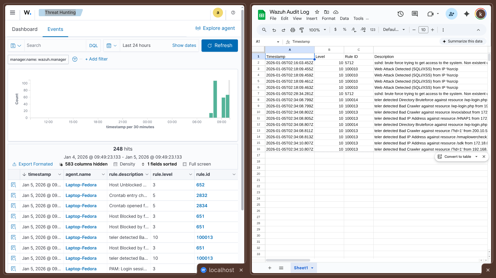

# Wazuh Automation Lab 🛡️

A collection of independent automation scripts for Wazuh SIEM to streamline monitoring, reporting, and alerting in Docker environments. Each script serves a specific purpose and can be used standalone or combined based on your security operations needs.

## 📂 Repository Contents

This repository contains three independent automation scripts:

| Script | Purpose | Technology |
|--------|---------|------------|
| **[generate_report.sh](#-1-automated-dashboard-snapshot-reporting-bash)** | Email dashboard snapshots via SMTP | Bash + opensearch-reporting-cli |
| **[wazuh_direct_write.py](#-2-live-agent-inventory-sync-python)** | Sync agent inventory to Google Sheets | Python + Wazuh API + Google Sheets API |
| **[wazuh_audit_logger.py](#-3-critical-alert-audit-logger-python)** | Log critical alerts to Google Sheets | Python + OpenSearch + Google Sheets API |

---

## 🚀 1. Automated Dashboard Snapshot Reporting (Bash)

### Overview

Automatically generates visual reports from Wazuh Dashboard snapshots and delivers them via email using SMTP. Perfect for scheduled executive summaries and team status updates without manual intervention.

### Architecture


*Architecture: Wazuh Dashboard Short URL → opensearch-reporting-cli → PDF/PNG Generation → SMTP Delivery*

### How It Works

1. **Connects** to Wazuh Dashboard using a pre-configured Short URL (snapshot)
2. **Authenticates** using basic credentials
3. **Generates** PDF or PNG report using opensearch-reporting-cli
4. **Sends** report via SMTP (supports Gmail, Office365, or custom mail servers)
5. **Bypasses** SSL verification for self-signed certificates (lab environment)

### Key Features

- ✅ Works with self-signed SSL certificates
- ✅ Uses Dashboard Short URLs (no complex API queries needed)
- ✅ Supports multiple SMTP providers
- ✅ Customizable email subject and body
- ✅ PDF or PNG format options
- ✅ Simple bash script - no Python dependencies

### Prerequisites

* Wazuh Dashboard running (Docker or standalone)
* **Node.js** (v14 or higher)
* **opensearch-reporting-cli** installed globally:
  ```bash
  npm install -g @opensearch-project/reporting-cli
  ```
* SMTP account credentials:
  - Gmail: Requires [App Password](https://support.google.com/accounts/answer/185833)
  - Office365: Use account credentials
  - Custom SMTP: Server details required

### Configuration

1. **Create a Dashboard Short URL:**
   - Open your Wazuh Dashboard
   - Navigate to the view you want to report (e.g., Security Events Overview)
   - Click **Share** → **Short URL** → Copy the URL
   
   

2. **Edit `generate_report.sh`:**
   ```bash
   # 1. Dashboard Snapshot URL (Replace with your Short URL)
   URL="https://YOUR_WAZUH_DOMAIN/goto/YOUR_SNAPSHOT_ID"
   
   # 2. Wazuh Dashboard Credentials
   CREDS="admin:YOUR_WAZUH_PASSWORD"
   
   # 3. SMTP Configuration
   SMTP_HOST="smtp.gmail.com"      # or smtp.office365.com
   SMTP_PORT="465"                  # 587 for TLS, 465 for SSL
   SMTP_USER="your_email@gmail.com"
   SMTP_PASS="your_app_password"    # Gmail App Password
   
   # 4. Email Settings
   FROM="your_email@gmail.com"
   TO="recipient@example.com"       # Separate multiple with commas
   SUBJECT="[Wazuh] Daily Security Report"
   ```

3. **Make executable:**
   ```bash
   chmod +x generate_report.sh
   ```

### Usage

**Manual execution:**
```bash
./generate_report.sh
```

**Automated daily reports at 8 AM:**
```bash
crontab -e
# Add this line:
0 8 * * * /path/to/generate_report.sh >> /var/log/wazuh_report.log 2>&1
```

**Weekly reports (Monday at 9 AM):**
```bash
0 9 * * 1 /path/to/generate_report.sh >> /var/log/wazuh_report.log 2>&1
```

### Sample Output


*Example email with attached Wazuh dashboard snapshot report*


*Sample PDF showing security events overview, top agents, and alert trends*

### Troubleshooting

**Error: `opensearch-reporting-cli not found`**
```bash
# Install globally
npm install -g @opensearch-project/reporting-cli

# Verify installation
which opensearch-reporting-cli
```

**Error: Gmail SMTP authentication failed**
- Enable 2-Factor Authentication on your Google Account
- Generate an [App Password](https://support.google.com/accounts/answer/185833)
- Use the 16-digit app password (no spaces)

**Error: SSL certificate verification failed**
- The script includes `NODE_TLS_REJECT_UNAUTHORIZED=0` for self-signed certs
- For production, use valid SSL certificates

### Use Cases

- 📧 Daily/weekly executive security summaries
- 📊 Compliance reporting automation
- 🔔 Scheduled stakeholder updates
- 📝 Audit documentation generation
- 👥 Team status updates without dashboard access

---

## 📊 2. Live Agent Inventory Sync (Python)

### Overview

Synchronizes Wazuh agent inventory from the Wazuh Manager API to Google Sheets in real-time. Maintains an always-up-to-date spreadsheet of all monitored endpoints with their status, versions, and metadata.

### Architecture


*Architecture: Wazuh Manager API → Python Script → Google Sheets API → Live Spreadsheet (Clear & Replace)*

### How It Works

1. **Authenticates** with Wazuh Manager API using Basic Auth
2. **Retrieves** JWT token for session
3. **Fetches** complete agent list (up to 1000 agents)
4. **Clears** existing Google Sheet data
5. **Writes** updated inventory with headers
6. **Formats** data: Agent ID, Hostname, IP, OS, Status, Last Keep Alive, Version

### Key Features

- ✅ Complete inventory replacement (ensures data accuracy)
- ✅ Handles up to 1000 agents per sync
- ✅ Extracts detailed OS information
- ✅ Safe error handling for missing fields
- ✅ Automatic authentication with Wazuh API
- ✅ Works with self-signed SSL certificates

### Prerequisites

* Python 3.7 or higher
* Wazuh Manager with API enabled (default: port 55000)
* Google Cloud Service Account with credentials
* Google Sheets API enabled in GCP Console

### Installation

1. **Install Python dependencies:**
   ```bash
   pip install -r requirements.txt
   ```
   
   Or manually:
   ```bash
   pip install requests google-auth google-auth-oauthlib google-auth-httplib2 google-api-python-client urllib3
   ```

2. **Google Cloud Setup:**
   
   a. Create a Service Account:
   - Go to [Google Cloud Console](https://console.cloud.google.com)
   - Navigate to **IAM & Admin** → **Service Accounts**
   - Click **Create Service Account**
   - Download JSON credentials file
   
   b. Enable APIs:
   - Go to **APIs & Services** → **Library**
   - Search and enable: **Google Sheets API** and **Google Drive API**
   
   c. Share your Spreadsheet:
   - Open your Google Sheet
   - Click **Share**
   - Add the Service Account email (found in credentials.json)
   - Give **Editor** permissions
   
   

3. **Configure the script:**
   
   Edit `wazuh_direct_write.py`:
   ```python
   # 1. Wazuh API Configuration
   WAZUH_HOST = 'localhost'           # or your Wazuh Manager IP
   WAZUH_PORT = 55000
   WAZUH_USER = 'wazuh-wui'           # API username
   WAZUH_PASSWORD = 'your_password'
   
   # 2. Google Sheets Configuration
   SERVICE_ACCOUNT_FILE = './credentials.json'
   SPREADSHEET_ID = 'your_spreadsheet_id'  # From Sheet URL
   RANGE_NAME = 'Sheet1!A1'
   ```

### Usage

**Manual execution:**
```bash
python3 wazuh_direct_write.py
```

**Expected output:**
```
[1/3] Fetching data from Wazuh API...
[2/3] Connecting to Google Sheets...
      Clearing old data...
[3/3] Writing 15 rows to Google Sheet...
      SUCCESS! 120 cells updated.

[DONE] Check your Google Sheet now.
```

**Automated sync every 30 minutes:**
```bash
crontab -e
# Add this line:
*/30 * * * * /usr/bin/python3 /path/to/wazuh_direct_write.py >> /var/log/wazuh_inventory.log 2>&1
```

**Hourly sync:**
```bash
0 * * * * /usr/bin/python3 /path/to/wazuh_direct_write.py >> /var/log/wazuh_inventory.log 2>&1
```

### Spreadsheet Structure

The script creates the following columns:

| Agent ID | Hostname | IP Address | OS Name | OS Version | Status | Last Keep Alive | Wazuh Version |
|----------|----------|------------|---------|------------|--------|-----------------|---------------|
| 001 | web-server-01 | 192.168.1.10 | Ubuntu | 22.04 | active | 2024-01-05T10:30:00 | 4.7.0 |
| 002 | db-server-01 | 192.168.1.11 | CentOS | 8.5 | active | 2024-01-05T10:29:45 | 4.7.0 |

### Sample Output


*Real-time Google Sheet showing synchronized Wazuh agent inventory*

### Troubleshooting

**Error: `Login failed: Connection refused`**
- Verify Wazuh Manager is running: `systemctl status wazuh-manager`
- Check API is accessible: `curl -k https://localhost:55000`
- Verify port 55000 is not blocked by firewall

**Error: `Credentials file not found`**
- Verify `credentials.json` path is correct
- Use absolute path if needed: `/home/user/credentials.json`

**Error: `Permission denied on Google Sheets`**
- Share the spreadsheet with Service Account email
- Grant **Editor** permissions (not Viewer)
- Email format: `your-sa@your-project.iam.gserviceaccount.com`

### Use Cases

- 📋 Centralized endpoint inventory management
- 👥 Non-technical team access to agent status
- 📈 Integration with Google Data Studio dashboards
- 🔍 Quick agent lookup and status check
- 📊 Asset management and compliance tracking
- 🔄 Real-time infrastructure visibility

---

## 🔔 3. Critical Alert Audit Logger (Python)

### Overview

Automatically queries Wazuh Indexer (OpenSearch) for critical security alerts and appends them to a Google Sheets audit log. Creates a persistent, tamper-evident record of high-severity security events for compliance and investigation purposes.

### Architecture


*Architecture: Wazuh Indexer (OpenSearch) → Query Filter (Level ≥10) → Python Script → Google Sheets (Append-Only)*

### How It Works

1. **Queries** Wazuh Indexer using OpenSearch DSL syntax
2. **Filters** alerts by severity level (default: ≥10 for Critical)
3. **Filters** alerts by time window (default: last 60 minutes)
4. **Extracts** key information: timestamp, level, rule ID, description
5. **Detects** attacker IPs from multiple possible fields
6. **Appends** new alerts to Google Sheets (never overwrites)
7. **Maintains** complete audit trail with timestamps

### Key Features

- ✅ Append-only logging (preserves historical data)
- ✅ Configurable severity threshold
- ✅ Flexible time window for alert retrieval
- ✅ Smart IP address extraction (multiple field fallbacks)
- ✅ Timezone-aware datetime handling
- ✅ Rate limiting (max 100 alerts per execution)
- ✅ Perfect for compliance requirements (SOC 2, PCI-DSS, HIPAA)

### Prerequisites

* Python 3.7 or higher
* Wazuh Indexer with OpenSearch API access (default: port 9200)
* Google Cloud Service Account with Sheets API enabled
* Access to Wazuh Indexer credentials

### Installation

1. **Install dependencies:**
   ```bash
   pip install requests google-auth google-auth-oauthlib google-auth-httplib2 google-api-python-client urllib3
   ```

2. **Google Service Account Setup:**
   - Follow the same steps as [Inventory Sync - Google Cloud Setup](#installation-1)
   - Share your **audit log** spreadsheet with the Service Account email

3. **Configure the script:**
   
   Edit `wazuh_audit_logger.py`:
   ```python
   # 1. Wazuh Indexer Configuration
   INDEXER_HOST = 'https://localhost:9200'
   INDEXER_USER = 'admin'
   INDEXER_PASS = 'your_indexer_password'
   
   # 2. Google Sheets Configuration
   SERVICE_ACCOUNT_FILE = '/path/to/credentials.json'
   SPREADSHEET_ID = 'your_audit_log_spreadsheet_id'
   RANGE_NAME = 'Sheet1!A1'
   
   # 3. Alert Filtering
   MIN_LEVEL = 10                # Minimum severity (10=Critical, 7=High)
   TIME_WINDOW_MINUTES = 60      # Time range to fetch alerts
   ```

### Configuration Options

| Variable | Description | Default | Recommended Values |
|----------|-------------|---------|-------------------|
| `MIN_LEVEL` | Minimum alert severity | 10 | 10 (Critical only), 7 (High+Critical) |
| `TIME_WINDOW_MINUTES` | Historical time range | 60 | Match your cron interval |
| `RANGE_NAME` | Starting cell in sheet | Sheet1!A1 | Adjust if using templates |

**Important:** Set `TIME_WINDOW_MINUTES` to match your cron schedule to avoid gaps or duplicates:
- Hourly cron → `TIME_WINDOW_MINUTES = 60`
- Every 15 min → `TIME_WINDOW_MINUTES = 15`
- Every 30 min → `TIME_WINDOW_MINUTES = 30`

### Usage

**Manual execution:**
```bash
python3 wazuh_audit_logger.py
```

**Expected output:**
```
[1/3] Fetching alerts with Level >= 10 from last 60 minutes...
      Found 5 critical alerts.
[2/3] Appending 5 rows to Audit Log...
[3/3] Successfully logged to Audit Log.
```

**Automated hourly logging:**
```bash
crontab -e
# Add this line:
0 * * * * /usr/bin/python3 /path/to/wazuh_audit_logger.py >> /var/log/wazuh_audit.log 2>&1
```

**High-frequency monitoring (every 15 minutes):**
```bash
crontab -e
# Add this line:
*/15 * * * * /usr/bin/python3 /path/to/wazuh_audit_logger.py >> /var/log/wazuh_audit.log 2>&1
```
*Remember to set `TIME_WINDOW_MINUTES = 15` in the script*

### Audit Log Structure

The script appends data with these columns:

| Timestamp | Alert Level | Rule ID | Description | Agent Name | Attacker IP |
|-----------|-------------|---------|-------------|------------|-------------|
| 2024-01-05T10:30:15Z | 12 | 5710 | Multiple authentication failures | web-server-01 | 192.168.1.100 |
| 2024-01-05T10:45:22Z | 10 | 5503 | User login failed | db-server-01 | 10.0.0.50 |

### Sample Output


*Google Sheet showing append-only audit trail of critical security alerts*

### Advanced Usage

**Capture different severity levels:**

For medium-severity alerts:
```python
MIN_LEVEL = 7  # High + Critical
TIME_WINDOW_MINUTES = 60
```

For all alerts (not recommended for production):
```python
MIN_LEVEL = 3  # Low + Medium + High + Critical
TIME_WINDOW_MINUTES = 60
```

**Multiple alert logs:**

Create separate logs for different alert types:
```bash
# Critical alerts → Sheet1
python3 wazuh_audit_logger.py --config critical.conf

# High alerts → Sheet2
python3 wazuh_audit_logger.py --config high.conf
```

### Troubleshooting

**Error: `Failed to connect to OpenSearch`**
```bash
# Verify Indexer is running
curl -k -u admin:password https://localhost:9200

# Check indices exist
curl -k -u admin:password https://localhost:9200/_cat/indices | grep wazuh-alerts
```

**Error: `Permission denied (Google Sheets)`**
- Verify Service Account has **Editor** access
- Check `SPREADSHEET_ID` is correct (from URL)
- Ensure `credentials.json` path is absolute

**Issue: No alerts found**
```
[INFO] Found 0 critical alerts
```
Solutions:
- Lower `MIN_LEVEL` to 7 or 5
- Increase `TIME_WINDOW_MINUTES` to 120 or 180
- Verify alerts exist in Wazuh Dashboard for the time period
- Check Indexer has `wazuh-alerts-*` indices

**Issue: Duplicate alerts in log**
- Ensure `TIME_WINDOW_MINUTES` matches cron interval exactly
- Check multiple cron jobs aren't running simultaneously
- Verify system time is synchronized (use NTP)

### Use Cases

- 📋 Compliance audit trail (PCI-DSS, HIPAA, SOC 2)
- 🔍 Post-incident investigation and analysis
- 📊 Security metrics and KPI tracking
- 🚨 Historical alert pattern analysis
- 📈 Executive reporting on security posture
- 🔐 Regulatory compliance documentation
- 🔬 Threat hunting and trend analysis

---

## 📝 Related Articles

Read the detailed implementation guides on Medium:

* **Part 1:** How I Automated Wazuh Dashboard Reporting with Bash *(Add your Medium link)*
* **Part 2:** Real-time Server Inventory with Python & Google Sheets *(Add your Medium link)*
* **Part 3:** Building a Compliant Security Alert Audit Log *(Add your Medium link)*

---

## 🔒 Security Best Practices

### For Lab/Testing Environments:
- ✅ Use separate test credentials
- ✅ Keep `credentials.json` out of version control
- ✅ Use `.gitignore` to exclude sensitive files
- ✅ Test scripts in isolated environments first
- ✅ Regularly rotate passwords

### For Production Environments:
- 🔐 **Never hardcode credentials** - Use environment variables
- 🔐 Implement secrets management (HashiCorp Vault, AWS Secrets Manager)
- 🔐 Use Docker Secrets for containerized deployments
- 🔐 Enable MFA on all service accounts
- 🔐 Apply principle of least privilege
- 🔐 Monitor script execution and failures
- 🔐 Use valid SSL certificates (no self-signed)
- 🔐 Implement log rotation and archival
- 🔐 Regular security audits and credential rotation
- 🔐 Encrypt credentials at rest
- 🔐 Use network segmentation and firewall rules

### Credentials Management Example:

**Using environment variables:**
```bash
# .env file (never commit this)
export WAZUH_PASSWORD="your_password"
export INDEXER_PASSWORD="your_password"
export SMTP_PASSWORD="your_app_password"

# Load in script
source /path/to/.env
```

**Using Python environment variables:**
```python
import os
WAZUH_PASSWORD = os.environ.get('WAZUH_PASSWORD')
INDEXER_PASS = os.environ.get('INDEXER_PASSWORD')
```

---

## 📁 Repository Structure

```
wazuh-automation-lab/
├── images/                              # Screenshots and architecture diagrams
│   ├── snapshot-report-architecture.png
│   ├── create-short-url.png
│   ├── pdf-report-email.png
│   ├── pdf-report-content.png
│   ├── inventory-sync-architecture.png
│   ├── service-account-setup.png
│   ├── inventory-sheet-live.png
│   ├── inventory-before-after.png
│   ├── inventory-mobile-view.png
│   ├── alert-logger-architecture.png
│   ├── alert-log-sheet.png
│   ├── alert-trends-chart.png
│   └── alert-details-example.png
├── generate_report.sh                   # Dashboard snapshot reporting
├── wazuh_direct_write.py                # Agent inventory sync
├── wazuh_audit_logger.py                # Critical alert logger
├── requirements.txt                     # Python dependencies
├── .gitignore                           # Git ignore rules
├── LICENSE                              # MIT License
└── README.md                            # This file
```

---

## 🚀 Quick Start Guide

### Step 1: Clone the Repository
```bash
git clone https://github.com/yourusername/wazuh-automation-lab.git
cd wazuh-automation-lab
```

### Step 2: Install Dependencies

**For Bash scripts:**
```bash
# Install Node.js (if not already installed)
curl -fsSL https://deb.nodesource.com/setup_18.x | sudo -E bash -
sudo apt-get install -y nodejs

# Install opensearch-reporting-cli
npm install -g @opensearch-project/reporting-cli
```

**For Python scripts:**
```bash
pip install -r requirements.txt
```

### Step 3: Choose Your Scripts

Each script is independent - use what you need:

| Need | Use This Script |
|------|----------------|
| 📧 Automated reports | `generate_report.sh` |
| 📊 Live inventory | `wazuh_direct_write.py` |
| 🔔 Alert audit logs | `wazuh_audit_logger.py` |
| 🎯 Complete solution | All three! |

### Step 4: Configure Credentials

**Never commit credentials!** Use one of these methods:

1. **Environment variables** (recommended)
2. **Separate config files** (add to `.gitignore`)
3. **Secrets management tools** (production)

### Step 5: Test & Deploy

1. Run each script manually first
2. Verify output (email, Google Sheet)
3. Set up cron jobs for automation
4. Monitor logs for errors

---

## 🤝 Contributing

Contributions make the open-source community amazing! Here's how you can help:

### Ways to Contribute:

1. 🐛 **Report bugs** - Open detailed issues
2. 💡 **Suggest features** - Share your ideas
3. 🔧 **Submit PRs** - Improve code or docs
4. 📖 **Improve documentation** - Clarify instructions
5. ⭐ **Star the repo** - Show your support!
6. 📢 **Share** - Tell others about this project

### Contribution Process:

1. Fork the repository
2. Create a feature branch (`git checkout -b feature/AmazingFeature`)
3. Test your changes thoroughly
4. Commit with clear messages (`git commit -m 'Add: Amazing feature'`)
5. Push to your branch (`git push origin feature/AmazingFeature`)
6. Open a Pull Request with detailed description

### Contribution Guidelines:

- Follow existing code style and conventions
- Add comments for complex logic
- Update README if adding new features
- Test in lab environment before submitting
- Never include credentials in commits

---

## 📄 License

This project is licensed under the **MIT License** - see the [LICENSE](LICENSE) file for details.

### What this means:
- ✅ Free to use commercially
- ✅ Free to modify
- ✅ Free to distribute
- ✅ Free to use privately
- ⚠️ No warranty provided
- ⚠️ Must include license notice

---

## ⚠️ Disclaimer

These scripts are designed for **Lab and Testing environments**. 

**Before using in production:**

- ✅ Implement proper secrets management
- ✅ Follow your organization's security policies
- ✅ Test thoroughly in staging environment
- ✅ Set up proper monitoring and alerting
- ✅ Maintain regular backups
- ✅ Review and audit code
- ✅ Use valid SSL certificates
- ✅ Implement error handling and logging

**The authors are not responsible for:**
- Data loss or corruption
- Security breaches due to misconfiguration
- Service disruptions
- Compliance violations
- Any damages resulting from use of these scripts

**Use at your own risk. Always follow security best practices.**

---

## 📧 Contact & Support

### Get Help:

- 🐛 **Bug Reports:** [GitHub Issues](https://github.com/yourusername/wazuh-automation-lab/issues)
- 💬 **Questions:** [GitHub Discussions](https://github.com/yourusername/wazuh-automation-lab/discussions)
- 📝 **Blog Articles:** [Medium Profile](your-medium-profile-link)
- 💼 **Professional:** [LinkedIn Profile](your-linkedin-profile-link)

### Community:

Join the discussion and share your implementations!

- Share your use cases
- Report issues and improvements
- Contribute to documentation
- Help others in discussions

---

## 🙏 Acknowledgments

Special thanks to:

- **[Wazuh Team](https://wazuh.com)** - For the incredible open-source SIEM platform
- **[OpenSearch Community](https://opensearch.org)** - For the reporting tools and documentation
- **[Google Cloud](https://cloud.google.com)** - For the Sheets API and generous free tier
- **Open Source Community** - For inspiration and knowledge sharing

---

## 📊 Project Stats


---

**⭐ If you find this project helpful, please consider giving it a star!**

**📢 Share your implementations and improvements - we'd love to hear from you!**

**🚀 Happy Automating!**
